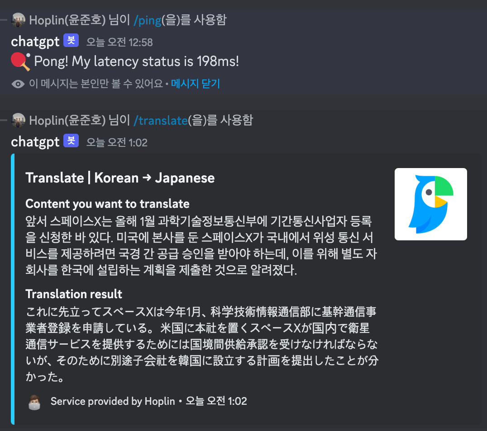
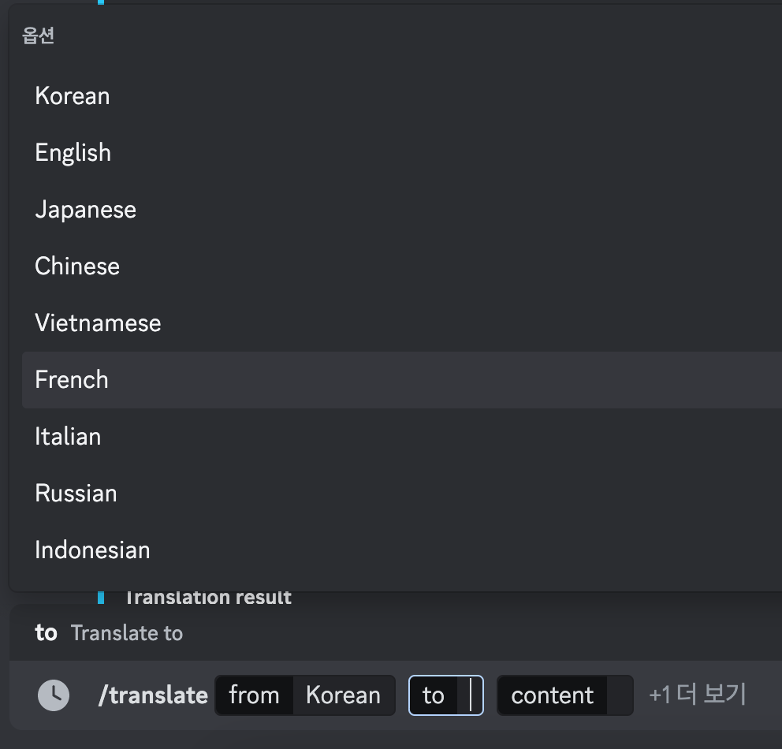

Chat-GPT discord command
===
***
- This project is remaked with [TypeScript](https://www.typescriptlang.org) and [Discord.js](https://discord.js.org/#/)!

- Recommend to use this version, but if you want to use Python version, please refer to this [link](https://github.com/J-hoplin1/Papago-API-Translate-Bot/tree/Python-Version).(Python version will be deprecated in near future)
***
## Prerequisite
### Discord Keys
- DISCORD_API
    - Get discord bot token in [here](https://discord.com/developers/applications).
    - Create application and go to tab `Bot`
- APPLICATION_ID
    - Get discord bot token in [here](https://discord.com/developers/applications).
    - Create application and go to tab `General Information`
- GUILD_ID
    - Make sure your discord's developer mode in active
    - Make right click on Guild's icon and click `Copy ID`

- Make privileged gateway intent as active in [here](https://discord.com/developers/applications).(tab `Bot`)
    

### Naver Papago API Keys

- Client ID & Client Secret
    - Enroll your application in `Naver Developers` and apply new application in [here](https://developers.naver.com/docs/papago/papago-nmt-overview.md) and get `Client ID` and `Client Secret` in `My application` tab

## Before Using

After you get all of keys I described in above, you need to fill keys in `.env` file

```bash
# Discord API Client
DISCORD_API=
APPLICATION_ID=
GUILD_ID=

# Naver API Client
X_Naver_Client_Id=
X_Naver_Client_Secret=
```

## Start Application
***

1. git clone project
    ```bash
    git clone https://github.com/J-hoplin1/Papago-API-Translate-Bot.git && cd Papago-API-Translate-Bot 
    ```

2. Build docker image
    ```bash
    docker build -t (image name) .
    ```

3. Run image as container
    ```bash
    docker run -d --name (container name) -v (directory you want to connect with container):/app/dist/logfile (image name)
    ```

## Commands 

- `/ping` : Check bot's ping
- `/translate` : Translate your content
    - Required
        - from : Language to be translated
        - to : Translated language
        - content : Content to translate
    - Not required
        - private : `Yes` if you want to see result in private(but temporary). 

    
    

## Supported Languages
- Korean
- English
- Japanese
- Chinese
- Vietnamese
- French
- Italian
- Russian
- Indonesian

