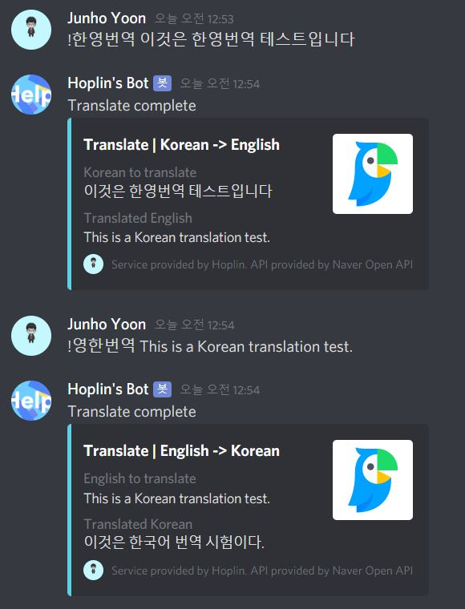
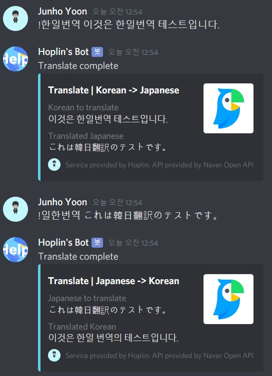
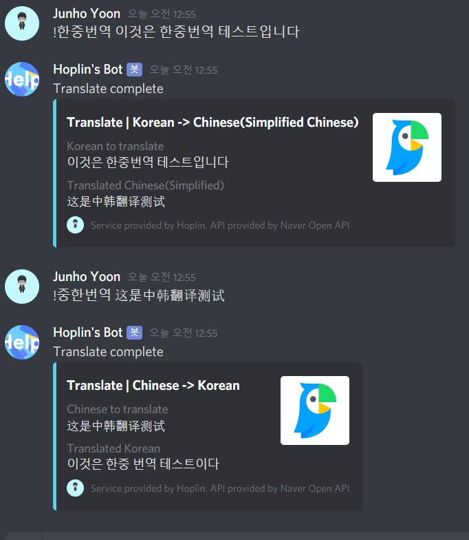

Discord Bot : Translation bot using papago API
===

***
1 . Discord.py Version : 1.0.0(Rewrite Version)

2 . Language : Python3

3 . What for? : Translation bot helps to translate words or sentences more faster with using command

4 . API provided from : [Naver Open API](https://developers.naver.com/main/)

5 . Papago API Documentation : https://developers.naver.com/docs/papago/

6 . Papago API's HTTP Method : POST

***

- Patch Note

 - 20200629 정기점검 완료 : 상태 : Good

 - 20210404 패치 : 리팩토링 버전으로 업데이트 되었습니다.  리팩토링 전 버전은 [여기](https://github.com/J-hoplin1/Papago-API-Translate-Bot/tree/Before_Refactoring)

***
  
  - Intertranslatable language in this code
  
    - Korean <-> English
    
    - Korean <-> Japanese
    
    - Korean <-> Chinese(Simplified Chinese)
  
  
  
  
  
  
